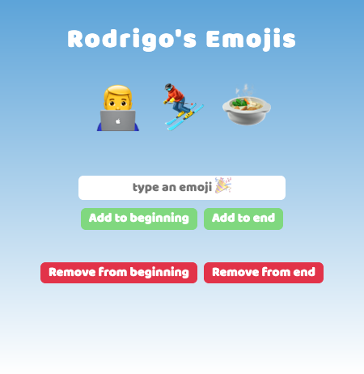
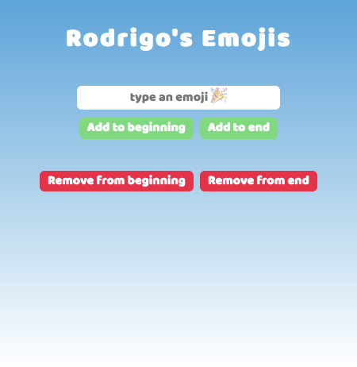

# Scrimba Frontend Career Path - (Emoji Personality - Module 03)

This is a solution to the [Scrimba Frontend Career Path - (Module/App name here)](https://scrimba.com/learn/frontend).

## Table of contents

- [Overview](#overview)
  - [The challenge](#the-challenge)
  - [Screenshot](#screenshot)
  - [Links](#links)
- [My process](#my-process)
  - [Built with](#built-with)
  - [What I learned](#what-i-learned)
  - [Continued development](#continued-development)
  - [Useful resources](#useful-resources)
- [Author](#author)
- [Acknowledgments](#acknowledgments)

## Overview

### The challenge

Users should be able to Code/Understand:

- createElement()
- append()
- 

### Screenshot

### Links

- Solution Github URL: [https://github.com/Rod-Barbosa/emoji-personality](https://github.com/Rod-Barbosa/emoji-personality)
- Live Site URL: [https://rodrigo-lead-saver-chrome-extension.netlify.app/](https://rodrigo-emoji-personality.netlify.app/)

## My process

### Built with

- Semantic HTML5 markup
- CSS custom properties
- JavaScript

### What I learned
Creating a container and appending it to a "parent" is very useful, and intuitive.

### Continued development

The course is getting more and more interesting. I'm very surprised how educational coding a chrome extension (witha real world use) can be.

### Useful resources

- [Select input color change](https://stackoverflow.com/questions/43427993/change-the-color-of-a-input-field-when-selected?rq=1) - Quick and sweet CSS trick
- [.value](https://stackoverflow.com/questions/11563638/how-do-i-get-the-value-of-text-input-field-using-javascript) - This is always gonna be there. Grabbing the actual value the user is inputting on the browser. This will become second nature and it is nice to know how it works
- [Clear textbox JavaScript](https://stackoverflow.com/questions/4135818/how-to-clear-a-textbox-using-javascript) - Very rarely we want the input field to keep what was just saved
- [Open Link on another tab](https://www.freecodecamp.org/news/how-to-use-html-to-open-link-in-new-tab/) - target="_blank"
- [Double click Event](https://techstacker.com/how-to-detect-double-clicks-with-vanilla-javascript/) - To avoid losing all your leads but accident, delete checks for double click before clearing localStorage
- [Select current Tab Chrome](https://stackoverflow.com/questions/6718256/how-do-you-use-chrome-tabs-getcurrent-to-get-the-page-object-in-a-chrome-extensi) - Easier to go on SO than to go to the google official explanation

**Note: Delete this note and replace the list above with resources that helped you during the challenge. These could come in handy for anyone viewing your solution or for yourself when you look back on this project in the future.**

## Author

- Website - [Rodrigo Portfolio](https://www.gelatodigital.com)
- Frontend Mentor - [@Rod-Barbosa](https://www.frontendmentor.io/profile/Rod-Barbosa)
- Github - [@Rod-Barbosa](https://github.com/Rod-Barbosa)

## Acknowledgments

Thanks again the SO for showing hwo to deal with crome tabs without having to read all the documentation
